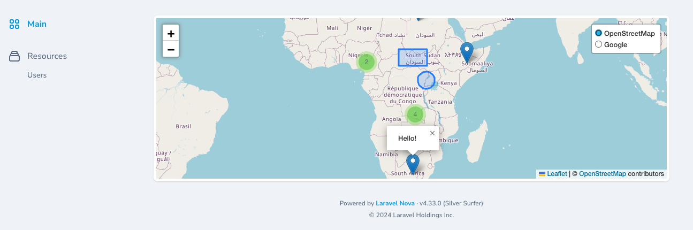
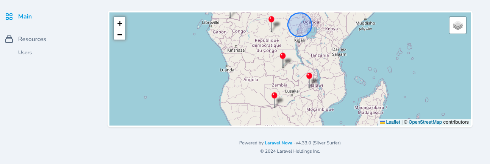

# Nova4CardMap
Custom [Laravel Nova 4](https://nova.laravel.com/) map card using [Leaflet](https://leafletjs.com/). Supports Google Maps, marker clustering, map height, latitude and longitude coordinates, GeoJSON, marker popup and custom marker icons.



### Installation

```
composer require imumz/nova-4-card-map
```
### Usage

```
use Imumz\Nova4CardMap\Nova4CardMap
...
(new Nova4CardMap())->width("1/2")

```
### Available Methods

#### Height
```
(new Nova4CardMap())
->height('400px') // default is 300px
```
#### Google Maps
By default the provider is OpenStreetMaps.<br> 
You must set your Google Maps API key (https://developers.google.com/maps/documentation/javascript/get-api-key).
```
(new Nova4CardMap())
->googleApiKey('')
->googleMapType('roadmap'), // roadmap, satellite or hybrid
```
#### Latitude / Longitude (Point)
```
(new Nova4CardMap())
->type('LatLon')
->point('-6.081689','145.391881')
```
#### GeoJSON
```
(new Nova4CardMap())
->type('GeoJson')
->geoJson('')
```
#### GeoJson Example 
```
{
  "type": "FeatureCollection",
  "features": [
    {
      "type": "Feature",
      "properties": {
        "popup": "I am a Popup"
      },
      "geometry": {
        "type": "Point",
        "coordinates": [
          23.8623046875,
          -30.221101852485987
        ]
      }
    }
  ]
}
```

#### Popup
```
(new Nova4CardMap())
->popup('popup')
```
#### Custom Marker Icon
```
(new Nova4CardMap())
->markerIcon('/images/marker-icon.png')
```
You can pass additional parameters to set the icon size and anchor
```
->markerIcon('/images/marker-icon.png',[100,100],[50,50])
```



